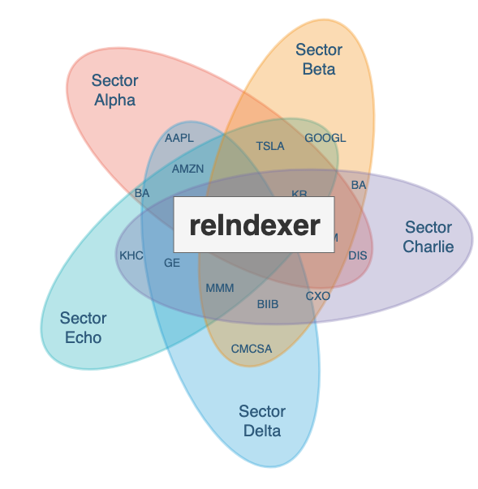

<p align="center">
    
</p>

<div style="text-align:center">
<b>reIndexer is a research tool for backtest-driven evaluation of different sectorization universes, using a system of synthetic ETFs, and efficient portfolios of those ETFs.</b>
</div>

## Usage Instructions

1. Install the Technical Analysis Library ([TA-Lib](https://ta-lib.org/)) for your operating system. For macOS, this can be done with brew (see TA-Lib page for other install options).

```bash
$ brew install ta-lib
```

2. Load the appropriate conda environment from the `conda/` folder for your operating system.

```bash
$ conda env create -f conda/{environment/environment-windows}.yml
```

3. Decrypt the configuration file

```bash
$ make decrypt_conf
```

4. Load the configuration file

```bash
$ source config/main.conf
```

TODO: Add notes on how to download data bundles here

- That's it!


## Sector Universe Files

The `Universe` submodule requires that sector universe files are in the following format (as a CSV file):

|sector|ticker|
|:----:|:----:|
|sector_1|asset_11|
|sector_1|asset_1n|
|sector_2|asset_21|
|sector_2|asset_2n|
|sector_n|asset_n1|
|sector_n|asset_nn|

Note that the column names are important; the `Universe` submodule will fail if this format is not followed exactly.
